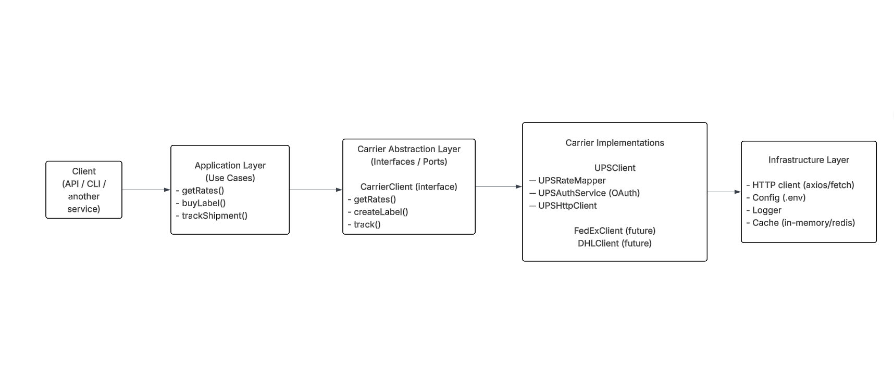
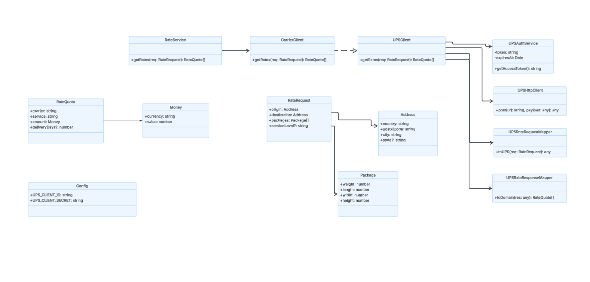

# Carrier Integration Service

TypeScript service that wraps the **UPS Rating API** to fetch shipping rates. Built as a maintainable, extensible module so we can add more carriers (FedEx, USPS, DHL) and operations (labels, tracking, address validation) without rewriting existing code.

This project fulfills the [Cybership Carrier Integration Take-Home](https://developer.ups.com/tag/Rating?loc=en_US) requirements: rate shopping, OAuth 2.0 client-credentials with token caching, strong types and validation, structured errors, and integration tests with stubbed HTTP.

---

## Architecture diagrams

**High-level layers (Client → Application → Carrier Abstraction → Implementations → Infrastructure):**



**UML class diagram (RateService, CarrierClient, UPSClient, mappers, auth, domain models):**



---

## Architecture

The design follows a layered flow: **Client → Application → Carrier Abstraction → Carrier Implementations → Infrastructure**.

| Layer | Role | In this repo |
|-------|------|----------------|
| **Client** | Entry point (API, CLI, or another service) | Consumes `RateService` |
| **Application (use cases)** | Orchestrates business operations | `getRates()` in `src/service.ts` |
| **Carrier abstraction** | Common interface for all carriers | `RateCarrierAdapter` in `src/carriers/types.ts` |
| **Carrier implementations** | Carrier-specific API logic | `src/carriers/ups/` (UPS only today) |
| **Infrastructure** | HTTP, config, auth cache | `src/http/`, `src/config/`, `src/auth/` |

**Request flow for get rates:**

1. **RateService** receives a `RateRequest`, validates it (Zod), then calls each configured carrier adapter.
2. **CarrierClient (adapter)** — e.g. **UPSClient** — implements `getRates(request): Promise<RateQuote[]>`.
3. **UPSClient** coordinates:
   - **UPSAuthService (OAuth)** — token acquisition and refresh (`src/carriers/ups/oauth.ts`, `src/auth/token-cache.ts`).
   - **UPSRateRequestMapper** — domain `RateRequest` → UPS request body (`src/carriers/ups/rating.ts` → `buildUpsRateRequest`).
   - **UPSHttpClient** — POST to UPS Rating API with Bearer token and timeout (`src/carriers/ups/client.ts`).
   - **UPSRateResponseMapper** — UPS response → `RateQuote[]` (`parseUpsRateResponse` in `rating.ts`).

Domain models (`RateRequest`, `RateQuote`, `Address`, `PackageDimensions`) live in `src/types/domain.ts`. Callers never see UPS-specific request/response shapes; only normalized types.

---

## Design decisions

- **Single adapter interface** — `RateCarrierAdapter` has `carrierId` and `getRates()`. Adding FedEx means implementing that interface and registering the adapter; no changes to `RateService` or UPS code.
- **Validation before external calls** — `RateService` validates input with Zod (`rateRequestSchema`) and throws `CarrierIntegrationError` with code `VALIDATION_ERROR` before calling any carrier.
- **Token cache in auth layer** — `createTokenCache()` in `src/auth/` handles acquire/reuse/refresh; UPS OAuth only fetches tokens. Callers use `getToken()` and never deal with expiry.
- **Injectible fetch** — Carriers and OAuth accept an optional `FetchFn`. Tests stub it; production uses `fetchWithTimeout()` from `src/http/`.
- **Structured errors** — `CarrierIntegrationError` with `code` (`AUTH_FAILED`, `RATE_LIMITED`, `CARRIER_ERROR`, `NETWORK_ERROR`, `TIMEOUT`, `MALFORMED_RESPONSE`, `VALIDATION_ERROR`), optional `statusCode` and `details`, and `toJSON()` for logging.

---

## Project structure

```
diagrams/                   # Architecture diagrams
├── big_diagram.png         # Layered view (Client → … → Infrastructure)
└── class_diagram.png       # UML: RateService, UPSClient, mappers, domain

src/
├── service.ts              # Application: RateService (getRates use case)
├── config/                 # Infrastructure: loadConfig() from env
├── auth/                   # Infrastructure: token cache (OAuth reuse/refresh)
├── http/                   # Infrastructure: fetchWithTimeout, errorFromResponse
├── errors/                 # Shared: CarrierIntegrationError, ErrorCode
├── types/                  # Domain: RateRequest, RateQuote, Address, PackageDimensions
├── validation/             # Shared: Zod schemas (rateRequestSchema, etc.)
└── carriers/               # Carrier abstraction + implementations
    ├── types.ts            # Carrier abstraction: RateCarrierAdapter, CarrierId
    ├── index.ts            # Re-exports + createUpsCarrier
    └── ups/                # Carrier implementation: UPSClient
        ├── index.ts        # createUpsCarrier, wires client + auth
        ├── client.ts       # UPSHttpClient (Rating API POST)
        ├── oauth.ts        # UPSAuthService (OAuth client-credentials)
        ├── rating.ts       # UPSRateRequestMapper + UPSRateResponseMapper
        └── types.ts        # UPS API request/response payload types

tests/
└── integration/
    ├── ups-rating.test.ts   # Request building + response parsing
    ├── ups-errors.test.ts   # 4xx/5xx, malformed JSON, timeout, validation
    ├── auth-lifecycle.test.ts # Token acquire, reuse, refresh
    └── fixtures/
        └── ups-rate-response.json
```

**Folder structure vs architecture**

| Diagram layer | Location in repo |
|---------------|------------------|
| **Client** | External (API/CLI/service that imports `RateService`) |
| **Application (use cases)** | `src/service.ts` — `getRates()` |
| **Carrier abstraction** | `src/carriers/types.ts` — `RateCarrierAdapter` |
| **Carrier implementations** | `src/carriers/ups/` — UPSClient; add `fedex/`, `dhl/` later |
| **Infrastructure** | `src/config/`, `src/auth/`, `src/http/` |

Domain models live in `src/types/domain.ts`. The empty `src/domain/` folder is legacy; all domain types are in `src/types/`.

---

## How to run

**Prerequisites:** Node.js ≥ 18.

```bash
# Install
npm install

# Copy env and set secrets (no real API key required for tests)
cp .env.example .env
# Edit .env: UPS_CLIENT_ID, UPS_CLIENT_SECRET if you have credentials

# Build
npm run build

# Tests (stubbed HTTP; no live API)
npm run test

# Lint (typecheck + tests)
npm run lint
```

**Scripts:**

| Script | Command | Description |
|--------|---------|-------------|
| `build` | `tsc` | Compile to `dist/` |
| `test` | `vitest run` | Run integration tests |
| `test:watch` | `vitest` | Run tests in watch mode |
| `dev` | `tsx --watch src/index.ts` | Run app in dev with watch |
| `start` | `node dist/index.js` | Run compiled app |
| `lint` | `tsc --noEmit && vitest run` | Type-check + tests |

---

## Environment variables

See **`.env.example`**. Required for live UPS calls:

- `UPS_CLIENT_ID`, `UPS_CLIENT_SECRET` — OAuth client credentials
- `UPS_BASE_URL` (optional, default: `https://onlinetools.ups.com`)
- `UPS_OAUTH_URL` (optional, default: base URL + `/security/v1/oauth/token`)
- `HTTP_TIMEOUT_MS` (optional, default: 15000)
- `OAUTH_TIMEOUT_MS` (optional, default: 5000)

All secrets and env-specific values are loaded via `loadConfig()`; nothing is hardcoded.

---

## References

- [UPS Rating API documentation](https://developer.ups.com/tag/Rating?loc=en_US)
- Take-home PDF: *Carrier Integration Service — Backend Engineering Take-Home Assessment* (Cybership)
